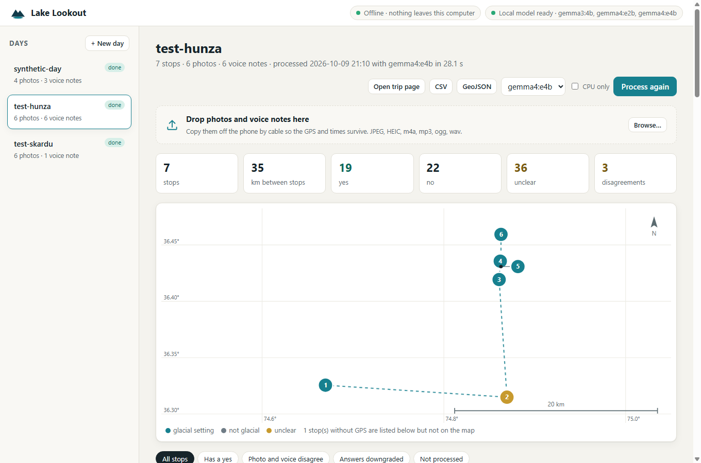

# Lake Lookout

**Hike with your phone. At each lake, take a photo and say what you see.
That evening, with no internet, a local open-weight model turns the day into a
glacial-lake field log.**

On the trail the screen stays in your pocket. You use your phone's own camera
and voice recorder. Back at the teahouse, campsite or home, Lake Lookout reads
the day's photos and voice notes on your laptop, and Gemma 4 (via Ollama)
answers a short field checklist for every stop. The checklist is drawn from
published glacial-lake hazard indicators, and every answer has to name its
evidence. You get:

- `trip.html`: one self-contained page with your route, photos, what you said,
  and the checklist for each stop. It opens with the network off.
- `field_log.csv` and `field_log.geojson`: the same observations in forms a
  researcher can load straight into a spreadsheet or a GIS.

Nothing leaves the computer. The tool blocks every network connection except
the one to the local model while it runs.

## Why

In August 2026 I built a separate project that screened Himalayan glacial lakes
from free satellite images. Its sharpest finding was about what satellites
*cannot* see. Thyanbo Tsho, above the village of Thame in Nepal, burst on
16 August 2024. In the pre-event satellite record for the four events that
project studied, **only 1 of 16 scenes got past the cloud-and-snow quality
filter**. The monsoon hid the lakes exactly when they mattered.

People were walking past those lakes the whole time: trekkers, guides,
porters, herders. Lake Lookout turns a hiker into the observation the satellite
missed. It records what is there, with evidence, for people qualified to
interpret it.

**It is not a warning system.** It gives no risk score and raises no alert. It
does not say whether a lake is dangerous; it only records what was seen.

## Quick start

You need [Ollama](https://ollama.com), [ffmpeg](https://ffmpeg.org) and
Python 3.11+.

```bash
ollama pull gemma4:e4b            # or gemma4:e2b for a laptop without a GPU
python -m venv .venv && .venv/Scripts/pip install -r requirements.txt   # Windows
# python -m venv .venv && .venv/bin/pip install -r requirements.txt     # macOS/Linux

python -m lookout ui              # the app, in your browser at http://127.0.0.1:8765
```



**Live demo (read-only):** the three processed test days, in the real app UI, at https://hassan-2050.github.io/lake-lookout/ once GitHub Pages is on (see below).

**[Watch the narrated demo on YouTube](https://youtu.be/1rj782juY7c)** ([MP4](docs/post/lake-lookout-demo.mp4), [captions](docs/post/lake-lookout-demo.srt)) (98 s: the real app and model on the Hunza test day; the voice is Kokoro-82M, an open-weight text-to-speech model run locally) ·
more: [the whole day](docs/screenshots/04-result.jpg) · [phone](docs/screenshots/06-phone.jpg) · [dark mode](docs/screenshots/07-dark.jpg)

**The app** runs entirely on your computer and answers only requests from this
machine.
- Make a day, then drag the day's photos and voice notes in.
- Choose a model, or tick *CPU only* on a laptop without a GPU.
- Press **Process**. Progress updates stop by stop.

You get:
- an offline route map with a scale bar, and pins coloured by glacial setting;
- one card per stop with photo, voice-note playback, transcript and summary;
- the observations first, with anything the model couldn't judge folded into
  one line;
- the evidence, citation and in-view rule behind each answer, one click away;
- filters for disagreements and downgraded answers;
- downloads of the trip page, CSV and GeoJSON.

It works in dark mode and at phone width.

The same pipeline from the command line:

```bash
python -m lookout process trips/2026-10-10             # -> trips/2026-10-10/lookout_out/trip.html
python -m lookout process trips/2026-10-10 --dry-run   # see how files group into stops
python -m lookout process trips/2026-10-10 --cpu       # no GPU: uses gemma4:e2b on CPU
```

**Try it without going anywhere.** The repo has three test days, each clearly
labelled as test data:
- `trips/synthetic-day/`: synthetic test data built from the evaluation photos.
- `trips/test-hunza/` and `trips/test-skardu/`: two days in Gilgit-Baltistan
  assembled from freely licensed Wikimedia photos. The photographers' recorded
  camera positions are written into the EXIF, the clock times are invented,
  and the voice notes are synthetic.

They include glaciers with no lake in frame, places with no water at all, a
dammed reservoir and a heavily edited winter photo. Attribution is in each
day's README.

**On the trail:** turn on location for the camera. At each lake, take one
wide photo that shows the shore, the outlet end and anything above the water.
Then record a 10–30 second voice memo of what you see. Recorder apps on
Android and iPhone both work (m4a, mp3, ogg, wav, 3gp). iPhone HEIC photos
are read directly.

## What it records

Each stop is one or more photos taken close together (within 5 minutes and
150 m), plus any voice memos recorded there. A memo with no photo nearby
becomes a voice-only stop.

| Observation | Published indicator it corresponds to |
|---|---|
| Water body; glacial setting | none (field observation) |
| Glacier touches water | Rounce et al. 2016, mother glacier within 600 m |
| Icebergs or calving | Sakai et al. 2009, calving onset |
| Steep slopes or hanging ice above | Fujita et al. 2013; Rounce et al. 2016 |
| Fresh rockfall scars above | Allen et al. 2019, impulse-wave trigger |
| *Dam or outlet in view?* | scope question; see below |
| Moraine dam | none (field observation) |
| Low freeboard | Mergili & Schneider 2011 |
| Steep dam face | Lv et al. 1999 (moderate confidence) |
| Seepage or breach | none (field observation) |
| *Downstream in view?* | scope question; see below |
| People or structures downstream | none (field observation) |

Every answer is **yes**, **no** or **unclear**, plus a short evidence phrase
and its source (photo, voice or both).

## How it keeps itself honest

Running the model is the easy part. The work in this repo is about making it
**unable to claim more than it saw**. Each rule below was added because the
evaluation showed the model doing the thing it prevents.

1. **Evidence comes before the answer.** The JSON schema the model is held to
   lists `evidence` before `answer`, and the model generates fields in schema
   order. With the answer first, it wrote `"no"` and then `"none"` as the
   evidence.
2. **A yes or a no without evidence becomes unclear.** An unsupported "no" is
   the dangerous one: it reads as "nothing there" and never looks like a
   failure.
3. **You can't claim absence for what's out of view.** The model said "no
   seepage visible" about dams that were behind the camera. Two scope
   questions ("is the dam in view?", "is downstream in view?") now gate those
   items. If the area isn't confirmed in view, only the hiker's own words can
   answer them.
4. **Photo and voice are asked about separately, then merged.** Given both at
   once, the model stopped looking at the photo, and it quoted one sentence
   about a rock ridge as evidence for six unrelated answers. When the photo and
   the hiker disagree, the log shows both and marks the item unclear rather than
   picking one.
5. **Voice evidence must be in the transcript and about the question.** It is
   checked against the transcript and against each item's keywords.
6. **"I can't see it" is never a yes or a no**, whether the model writes a
   straight or a curly apostrophe.
7. **Offline is enforced, not assumed.** Every non-loopback connection raises
   an error during processing (`lookout/offline.py`).

Every downgrade is kept, with its reason, and shown on the trip page under
each stop.

## Measured

`eval/run_eval.py` scores the checklist on 11 freely licensed lake photos (7
glacial, a glacier with no lake, 3 non-glacial controls: a landslide lake, a
reservoir and a village pond). Each photo is sent on its own, the way a stop is
processed. 91 answers are scored.

**Each iteration was measured before the next one was made** (gemma4:e4b, on
the GPU):

| version | change | accuracy | false yes | false no | too cautious |
|---|---|---|---|---|---|
| v1 | answer first | 75% | 3 | 4 | 16 |
| v2 | evidence first | 71% | 5 | **18** | 3 |
| v3 | scope questions gate dam and downstream items | 82% | 4 | 5 | 7 |
| v4 | final prompt | **88%** | **0** | **3** | 8 |
| v5 | v4 plus verifier bug fixes (below) | 87% | 0 | 3 | 9 |

v2 is the instructive one. Making the model state evidence first ended the
unsupported answers, but it then confidently said "no" about things it could
not see. The scope questions in v3 fixed that.

**Model comparison** (same prompt, same photos, RTX 4090, warm):

| model | accuracy | false yes | false no | per photo |
|---|---|---|---|---|
| gemma4:e4b | 88% | 0 | 3 | 2.4 s |
| gemma4:e2b | 85% | 1 | 7 | 1.6 s |
| gemma3:4b (v3 prompt) | 65% | 7 | 4 | slow on this machine* |

`gemma4:e2b` **on CPU only** (Intel i7-12700F, no GPU): 86% accuracy, about
**20 s per photo**, so roughly 3 minutes for an 8-stop day. A laptop CPU will
be slower than this desktop chip.

*Another program was holding most of the GPU's memory during that run, so
gemma3:4b's timing isn't representative and isn't quoted.

**What these numbers are not.**
- **Small sample:** 11 photos.
- **Labels:** drafted by the coding agent from looking at each photo and
  pending a person's review (`eval/labels.json` records this).
- **Run-to-run variation:** e4b scored 82% in two runs of v3 and 88% in v4, so
  treat differences of a few points as noise. The one consistent difference is
  that e4b makes fewer false "no" answers than e2b, which is why it's the
  default.
- **Voice path:** tested on the synthetic and internet test days, not on a
  labelled set.

**What realistic photos showed** (the two Gilgit-Baltistan test days).
- **A heavily edited winter photo produced a confident hallucination.** The
  model "saw" a moraine dam, low freeboard and the outlet, each with plausible
  evidence. No rule can catch that, because the evidence looks fine and the
  model says the dam is in view. Stylised or HDR photos are a real limit; plain
  phone photos are what it is built for.
- **Place names get misheard.** The speech engine's "Attabad" was transcribed
  as "A bad lake", and "Satpara" as "Sapporo". The observations survive; the
  names don't.
- **The model sometimes repeated its answer as its evidence** (`"no"` on a
  village photo). Now treated as no evidence.
- **One rule had never worked.** An editing slip turned the regex `\b` in the
  "I can't see it" rule into a backspace character, so the rule matched
  nothing, and its tests passed through a different rule. Both are fixed, and
  the tests now check the *reason* for each downgrade.
- **Photo and voice merging behaved as designed at Satpara.** The hiker's
  "concrete dam" answered *moraine dam: no*. Whether the dam was in view
  ("behind me") was shown as a disagreement, not resolved.

## Deploying the demo

Processing a hike is deliberately *not* a web service: it would mean uploading
people's photos, voices and locations, and it needs a GPU model running all
the time. What is deployed is a **read-only static demo**: the real app UI over
processed days, with no server at all.

```bash
python -m lookout export --out docs/demo --featured test-hunza --repo https://github.com/hassan-2050/lake-lookout
python tools/check_static_site.py      # 22 browser checks of the exported site
```

On GitHub: **Settings → Pages → Deploy from a branch → `main` / `/docs`**.
`docs/index.html` forwards to `docs/demo/`. Any static host works the same way;
on Render, for example, it is a static site whose publish directory is
`docs/demo`.

## Privacy and ethics

- Photos, voice and locations never leave the laptop. The page has no
  external resources, and processing blocks the network.
- No risk scores and no alerts. Observations are for people qualified to
  interpret them.
- The locations of lakes and villages can be sensitive. Before you publish a
  day's log, decide whether to share exact coordinates.

## Repository

```
lookout/        ingest (EXIF time/GPS, memo times, grouping), audio (ffmpeg),
                gemma (Ollama client), checklist, verify (rules + merge),
                offline (network guard), report (CSV/GeoJSON/HTML),
                pipeline (shared by CLI and app), server + ui/ (the app), cli
eval/           photos + ATTRIBUTION.md, labels.json, run_eval.py, results/
tools/          make_synthetic_day.py, find_test_photos.py, make_internet_days.py,
                record_demo.py + narrate.py (Playwright + local TTS), take_post_shots.py, make_chart.py,
                check_trip_page.mjs, e2e_ui.mjs, check_static_site.py
trips/          synthetic-day/, test-hunza/, test-skardu/ (test data, labelled as such)
tests/          62 tests: python -m pytest
docs/           demo/ (exported read-only site), post/ (DEV write-up, video, images), screenshots/
```

Three levels of testing:
- `python -m pytest`: the rules, ingest, report, and the app's HTTP API. The
  API tests run the real server, with a stand-in model, through upload, process
  and download, plus the security checks.
- `node tools/check_trip_page.mjs <out-dir>`: checks a generated trip page
  against its CSV (no external resources, one card per stop, every answer
  matching).
- `node tools/e2e_ui.mjs trips/test-hunza`, with `python -m lookout ui`
  running: drives a real headless Chrome through the whole app, with the real
  local model. It makes a day, uploads files through the file picker, processes
  them, and then uses the map, filters, evidence rows and lightbox. It checks
  every photo decodes, that there is no horizontal scroll at phone width, and
  that the console has no errors. It saves screenshots to `docs/screenshots/`.

## Built with

- **Gemma 4** (E2B and E4B), Google's open-weight models, run locally through
  **Ollama**. Gemma 4 does both the speech transcription (audio input) and the
  checklist (image input), so one small local model covers the whole pipeline.
- Python, Pillow, ffmpeg.
- Built with **Claude Code** as the coding agent. The iteration loop recorded
  in `eval/results/` (hypothesis, change, measured result) is the loop it worked
  in.

Evaluation and synthetic-day photos are from Wikimedia Commons under CC BY and
CC BY-SA licences; see `eval/photos/ATTRIBUTION.md`. Code is MIT licensed.
